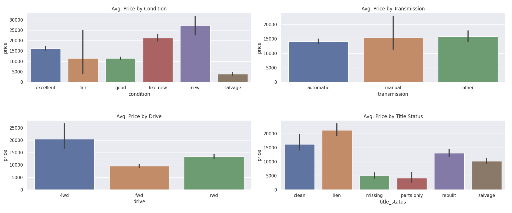

## Introduction:
The objective of this report is to present the findings of a data analysis project aimed at identifying the key drivers that influence the prices of used cars. The project aligns with the CRISP-DM (Cross-Industry Standard Process for Data Mining) methodology, focusing on transforming the business objective into a well-defined data problem.

## Business Problem:
The business problem at hand is to understand the factors that significantly impact the prices of used cars. By identifying these key drivers, stakeholders can make informed decisions regarding pricing strategies, vehicle valuation, and market competitiveness.

## Data Problem Definition:
The data problem entails conducting a comprehensive analysis using a dataset of used car listings. The aim is to leverage statistical and machine learning techniques to determine the primary predictors that have a substantial influence on the prices of used cars. This data-driven approach allows for the construction of a predictive model capable of estimating car prices accurately based on relevant features.

## Data Understanding


### Below is a description of the features present in the dataset:

**ID**: An identifier or unique identifier for each entry in the dataset.<br>
**Region**: The region or location where the vehicle is listed for sale.<br>
**Price**: The price of the vehicle listed for sale.<br>
**Year**: The manufacturing year of the vehicle.<br>
**Manufacturer**: The manufacturer or brand of the vehicle.<br>
**Model**: The model name or number of the vehicle.<br>
**Condition**: The condition or state of the vehicle (e.g., excellent, good, fair).<br>
**Cylinders**: The number of cylinders in the vehicle's engine.<br>
**Fuel**: The type of fuel the vehicle uses (e.g., gasoline, diesel, electric).<br>
**Odometer**: The number of miles or kilometers the vehicle has been driven.<br>
**Title Status**: The status of the vehicle's title (e.g., clean, salvage, rebuilt).<br>
**Transmission**: The type of transmission in the vehicle (e.g., automatic, manual).<br>
**VIN**: The Vehicle Identification Number, a unique identifier for the vehicle.<br>
**Drive**: The type of drive or drivetrain in the vehicle (e.g., 2-wheel drive, 4-wheel drive).<br>
**Size**: The size or class of the vehicle (e.g., compact, mid-size, full-size).<br>
**Type**: The body type or style of the vehicle (e.g., sedan, SUV, truck).<br>
**Paint Color**: The color of the vehicle's exterior paint.<br>
**State**: The state where the vehicle is listed for sale.<br>

```python
<class 'pandas.core.frame.DataFrame'>
RangeIndex: 426880 entries, 0 to 426879
Data columns (total 18 columns):
 #   Column        Non-Null Count   Dtype  
---  ------        --------------   -----  
 0   id            426880 non-null  int64  
 1   region        426880 non-null  object 
 2   price         426880 non-null  int64  
 3   year          425675 non-null  float64
 4   manufacturer  409234 non-null  object 
 5   model         421603 non-null  object 
 6   condition     252776 non-null  object 
 7   cylinders     249202 non-null  object 
 8   fuel          423867 non-null  object 
 9   odometer      422480 non-null  float64
 10  title_status  418638 non-null  object 
 11  transmission  424324 non-null  object 
 12  VIN           265838 non-null  object 
 13  drive         296313 non-null  object 
 14  size          120519 non-null  object 
 15  type          334022 non-null  object 
 16  paint_color   296677 non-null  object 
 17  state         426880 non-null  object 
dtypes: float64(2), int64(2), object(14)
```
<br>

* Missing Values: <br>
below shows that `size` has 72% missing values, we are going to drop this column during the modeling


<br>
<br>

* Rows with more than 10 Null columns
These rows will be dropped during the modeling as well since they are not offering any usefull information  

<br><br>

* Price Box Plot 
This plot indicates there are lots of outliers in the price columns which will be cleaned up during the data cleanup 

<br><br>

* Odometer KDE Plot
Odometer seems to have outliers too, we will try modeling without dropping these outliers and check the result. 

<br><br>


<hr>

### Univeriate Analysis

1. Sold Cars by Manufacturer


above plot shows the most car that was sold is Ford

<br>

2. Sold Cars by Condition 
<br>
Cars with Good Condition have been sold the most, and Excellent is the second, and maybe thats because the cars with excellent conditions are more expensive 


<br>

3. Value Counts For all the Features 


### Bivariate Analysis 

1. Avg. Price by Condition 


<br>

2. Avg. Price For Other Features 




<br>


3. Median Price by Manufacturer <br>
below is the bar plot of Median Price of Manufacturer Sold country wide.
as it indicates, the Ferrari is the most expensive car


<br>

4. Finding out Top 10 Sedan and All Manufacturer Sold in California <br>
As shown below, Honda Sedan was the most sold in california, but Ford manufacturer was the most sold. we will look in detail and compare these two 

<br><br>

5. Number of SUV Sold Across the US. <br>
As shown below, Jeep sold almost 12,000 SUV country wide

<br><br>

5. Number of Pickup Sold Across the US. <br>
This plot indicates Ford as Sold more than 12,000 Pickup Truck across the US. 

<br><br>

6. Top Manufacturers Sold in Each State<br>
As shown below, Ford has taken over the market of used cars across the US. 

<br><br>


7. Top 10 Ford Model Sold In California And Florida <br>
The dataset indicates, Ford F-150 is the most liked used car across the US. 


<br><br>

## Data Preparation

There are lots NaNs in the dataset, we probably need to go back to the business and gather more information about these Nans. but there are some rows that have almost all the columns NaN, so i have decided to drop those. <br>

I also dropped the all the NaNs in Manufacturer and Year columns. the rest of the NaNs will be imputed by most frequent and KNN. 
<br>

After dropping `id` I ended up with lots of duplicates, I dropped those duplicates if their `VIN` was the same or Null. <br>
I kept the rest of the duplicates as their `VIN` are different. 


- Dropping the outliers in the `price`<br>

```python 
df_copy = df_copy.query("1000 < price < 60000").copy()
```

**KDE Plot Of the Price after dropping the outliers:**

<br><br>


- Filling the `Cylinders` and `transmission` columns for `Electric` Cars to `other`

```ruby
df_copy.loc[df_copy["fuel"] == "electric", "cylinders"] = df_copy.loc[df_copy["fuel"] == "electric", "cylinders"].fillna("other")

df_copy.loc[df_copy["fuel"] == "electric", "transmission"] = df_copy.loc[df_copy["fuel"] == "electric", "transmission"].str.replace("automatic", "other")
```


- Imputing the Categorical Columns with `most_frequent` and Numerical Columns with KNN


```ruby
imputer = SimpleImputer(strategy='most_frequent')

df_imputed_cat = pd.DataFrame(imputer.fit_transform(df_copy.select_dtypes("object")), columns=df_copy.select_dtypes("object").columns)


imputer = KNNImputer(n_neighbors=2)

df_imputed_num = pd.DataFrame(imputer.fit_transform(df_copy.select_dtypes(["int", "float"])), columns=df_copy.select_dtypes(["int", "float"]).columns)

```
<br>

## Modeling 

- Features that I have decided to use for modeling: 
```ruby
'manufacturer'
'condition'
'cylinders'
'fuel'
'title_status'
'transmission'
'drive'
'type'
'year'
'odometer
```
All other features are dropped 
<br>
<br>
I tried to model with Lasso and LinearRegression but the best result came from Ridge hence continuing with Ridge 

### Modeling with Ridge Regression  

- Transforming all the categorical columns to OneHotEncoding, except the Condition. <br>
- Condition is being transformed with OrdinalEncoder <br>
- `cylinders`, `odometer`, and `year` are being transformed with Polynomial to 3 degree. I used 4 degres but seemed to be overfitted when checking the MSE of train and test, hence going with `degree=3`
- StandardScaler on all the numerical columns 
- Ridge Model with `alphas` from `0.1` to `100` and `random_state` of 10 and 100 <br>


<br><br>

#### MSE and Score of Test and Train Dataset 

```ruby
------------ Train and Test MeanSquaredError For Ridge ---------------
Train MSE: 6499.32
Test MSE : 6463.92
Best Hyperparameters : {'ridge__alpha': 0.1, 'ridge__random_state': 10}


------------ Train and Test Scores For Ridge ---------------
Ridge Train Score: 0.74
Ridge Test Score: 0.74

```

<br>
<br>
<hr>

## Retriving Coefficients to Determine Which Features Affects The Price

* Numerical Coefficients `Odometer` and `Year` and `Odometer Year` 
As indicated below, as the age of the car increases, the price goes lower, also if odometer goes higher, the price drops as well. 

<br><br>

* Manufacturers Coefficients


<br><br>

* Coefficients Of All Other Features 


<br><br>


From above plots of coefficients, we can conclude that bars that are above the zero line, will make the car expensive and the bars below the zero line will make the car less expensive. this can be provided to the car dealership to help their customers to pick a right car based on their budget. 


## Analysis of Factors Influencing Used Car Prices

**Introduction**
This report analyzes the factors influencing the prices of used cars based on the provided coefficient values for various features. By examining these coefficients, we gain insights into how different factors impact the pricing of used cars. The features examined include Manufacturer, Type, Fuel, Title Status, Transmission, Drive, and State.

**Manufacturer**
The coefficient values associated with different car manufacturers indicate the estimated impact of each brand on used car prices. Positive coefficients suggest a potential price increase, while negative coefficients indicate a potential price decrease. Some key findings from the Manufacturer coefficients are:

- Luxury Brands: Audi, BMW, Cadillac, Lexus, Mercedes-Benz, Porsche, and Tesla have positive coefficients, indicating that used cars from these luxury brands tend to command higher prices.

- Mainstream Brands: Acura, Chevrolet, Ford, GMC, Jeep, Lincoln, Nissan, Ram, Subaru, Toyota, and Volvo also have positive coefficients, indicating that used cars from these brands generally have higher prices compared to the baseline.

- Economy Brands: Brands such as Buick, Chrysler, Fiat, Honda, Hyundai, Mitsubishi, Saturn, and Volkswagen have negative coefficients, suggesting that used cars from these brands tend to have lower prices compared to the baseline.

**Type**
The Type coefficients indicate the influence of different car types on used car prices. Positive coefficients imply higher prices, while negative coefficients suggest lower prices. Key findings from the Type coefficients are:

- Convertible, Coupe, Offroad, Pickup, and Truck have positive coefficients, indicating that these car types tend to command higher prices in the used car market.

- Hatchback, Mini-Van, Sedan, SUV, and Wagon have negative coefficients, suggesting that these car types tend to have lower prices compared to the baseline.

**Fuel**
The Fuel coefficients represent the impact of different fuel types on used car prices. Positive coefficients indicate potential price increases, while negative coefficients suggest potential price decreases. Key findings from the Fuel coefficients are:

- Diesel has a positive coefficient, indicating that used cars powered by diesel tend to have higher prices.

- Gas, Hybrid, and Other fuel types have negative coefficients, suggesting that used cars running on these fuel types tend to have lower prices compared to the baseline.

**Title_Status**
The Title_Status coefficients represent the influence of different title statuses on used car prices. Positive coefficients imply higher prices, while negative coefficients suggest lower prices. Key findings from the Title_Status coefficients are:

- Clean title status has a positive coefficient, indicating that used cars with clean titles tend to have higher prices.

- Rebuilt and Salvage title statuses have negative coefficients, suggesting that used cars with these titles tend to have lower prices compared to the baseline.

**Transmission, Drive, and State**
The Transmission, Drive, and State coefficients represent the impact of different transmission types, drive types, and states on used car prices, respectively. Positive coefficients suggest potential price increases, while negative coefficients suggest potential price decreases.

- Key findings from the Transmission coefficients indicate that used cars with automatic transmissions tend to have higher prices compared to other transmission types.

- Positive coefficients for Drive types 4Wd (Four-Wheel Drive) and Rwd (Rear-Wheel Drive) indicate potential price increases, while a negative coefficient for Fwd (Front-Wheel Drive) suggests a potential price decrease.

- The coefficients associated with different states indicate the estimated impact of each state on used car prices. Positive coefficients imply potential price increases, while negative coefficients suggest potential price decreases.

**Conclusion**
This analysis provides insights into the factors influencing used car prices based on the coefficient values of various features. The coefficients help us understand the estimated impact of each feature on used car pricing. However, it is important to note that these coefficients are based on the provided information and should be interpreted


<br>

<hr>

### FYI - If you are interested testing this model, It has been saved in `best_model_so_far.sav` you can download this file and use it to predict used car prices 

<br>

* Code Example
```ruby
def predict_price(used_car):
    """
          Data Types passed to this function 
    -----------------------------------------------
        'manufacturer'      :       String
        'condition'         :       String
        'cylinders'         :       Integer 
        'fuel'              :       String
        'title_status'      :       String
        'transmission'      :       String
        'drive'             :       String            
        'type'              :       String
        'state'             :       String
        'year'              :       Integer
        'odometer'          :       Integer
    -----------------------------------------------
    """
    model = pickle.load(open("best_model_so_far.sav", 'rb'))
    feature_set = [
        'manufacturer',
        'condition',
        'cylinders',
        'fuel',
        'title_status',
        'transmission',
        'drive',
        'type',
        'state',
        'year',
        'odometer'
    ]
    used_car_df = pd.DataFrame([used_car], columns=feature_set)
    display(used_car_df)
    pred_with_ridge = model.predict(used_car_df)
    msg = f"The Estimated Price Of The Given Car Is: ${round(pred_with_ridge[0], 2)}"
    return msg


my_car = [
    "honda", 
    "good", 
    4,  
    "gas", 
    "clean", 
    "automatic", 
    "fwd", 
    "sedan",
    'ca',
    2012, 
    176000
]


predict_price(my_car)

```

- Dataframe passed to the model to predict: 


<br>

**Output:**<br>
`The Estimated Price Of The Given Car Is: $5873.85`


### Deployed App 
I have also deployed the app in one of my public facing websites. you can check it out

<h3><a href="http://klevernet.io/ai_ml_deployments/predict-car-price/">Deployed Model</a></h3>
