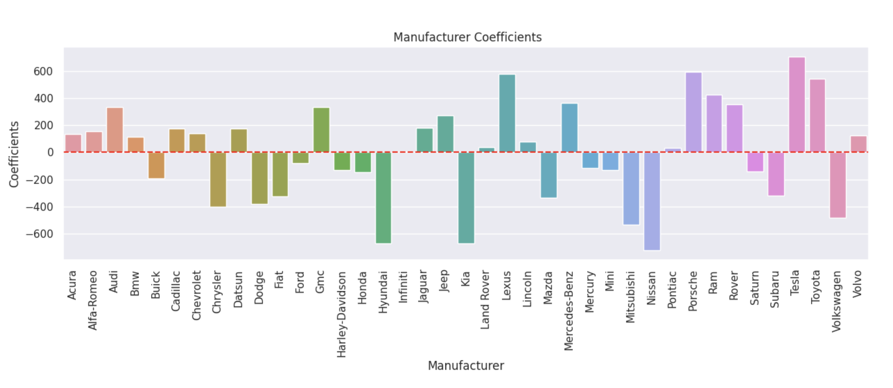

## Introduction:
The objective of this report is to present the findings of a data analysis project aimed at identifying the key drivers that influence the prices of used cars. The project aligns with the CRISP-DM (Cross-Industry Standard Process for Data Mining) methodology, focusing on transforming the business objective into a well-defined data problem.

## Business Problem:
The business problem at hand is to understand the factors that significantly impact the prices of used cars. By identifying these key drivers, stakeholders can make informed decisions regarding pricing strategies, vehicle valuation, and market competitiveness.

## Data Problem Definition:
The data problem entails conducting a comprehensive analysis using a dataset of used car listings. The aim is to leverage statistical and machine learning techniques to determine the primary predictors that have a substantial influence on the prices of used cars. This data-driven approach allows for the construction of a predictive model capable of estimating car prices accurately based on relevant features.

## Data Understanding


### Below is a description of the features present in the dataset:

**id**: An identifier or unique identifier for each entry in the dataset.<br>
**region**: The region or location where the vehicle is listed for sale.<br>
**price**: The price of the vehicle listed for sale.<br>
**year**: The manufacturing year of the vehicle.<br>
**manufacturer**: The manufacturer or brand of the vehicle.<br>
**model**: The model name or number of the vehicle.<br>
**condition**: The condition or state of the vehicle (e.g., excellent, good, fair).<br>
**cylinders**: The number of cylinders in the vehicle's engine.<br>
**fuel**: The type of fuel the vehicle uses (e.g., gasoline, diesel, electric).<br>
**odometer**: The number of miles or kilometers the vehicle has been driven.<br>
**title_status**: The status of the vehicle's title (e.g., clean, salvage, rebuilt).<br>
**transmission**: The type of transmission in the vehicle (e.g., automatic, manual).<br>
**VIN**: The Vehicle Identification Number, a unique identifier for the vehicle.<br>
**drive**: The type of drive or drivetrain in the vehicle (e.g., 2-wheel drive, 4-wheel drive).<br>
**size**: The size or class of the vehicle (e.g., compact, mid-size, full-size).<br>
**type**: The body type or style of the vehicle (e.g., sedan, SUV, truck).<br>
**paint_color**: The color of the vehicle's exterior paint.<br>
**state**: The state where the vehicle is listed for sale.<br>

```python
<class 'pandas.core.frame.DataFrame'>
RangeIndex: 426880 entries, 0 to 426879
Data columns (total 18 columns):
 #   Column        Non-Null Count   Dtype  
---  ------        --------------   -----  
 0   id            426880 non-null  int64  
 1   region        426880 non-null  object 
 2   price         426880 non-null  int64  
 3   year          425675 non-null  float64
 4   manufacturer  409234 non-null  object 
 5   model         421603 non-null  object 
 6   condition     252776 non-null  object 
 7   cylinders     249202 non-null  object 
 8   fuel          423867 non-null  object 
 9   odometer      422480 non-null  float64
 10  title_status  418638 non-null  object 
 11  transmission  424324 non-null  object 
 12  VIN           265838 non-null  object 
 13  drive         296313 non-null  object 
 14  size          120519 non-null  object 
 15  type          334022 non-null  object 
 16  paint_color   296677 non-null  object 
 17  state         426880 non-null  object 
dtypes: float64(2), int64(2), object(14)
```
<br>

* Missing Values: <br>
below shows that `size` has 72% missing values, we are going to drop this column during the modeling


<br>
<br>

* Rows with more than 10 Null columns
These rows will be dropped during the modeling as well since they are not offering any usefull information  

<br><br>

* Price Box Plot 
This plot indicates there are lots of outliers in the price columns which will be cleaned up during the data cleanup 

<br><br>

* Odometer KDE Plot
Odometer seems to have outliers too, we will try modeling without dropping these outliers and check the result. 

<br><br>


<hr>

### Univeriate Analysis

1. Sold Cars by Manufacturer


above plot shows the most car that was sold is Ford

<br>

2. Sold Cars by Condition 
<br>
Cars with Good Condition have been sold the most, and Excellent is the second, and maybe thats because the cars with excellent conditions are more expensive 


<br>

3. Value Counts For all the Features 


### Bivariate Analysis 

1. Avg. Price by Condition 


<br>

2. Avg. Price For Other Features 


<br>


3. Median Price by Manufacturer 
<br>
below is the bar plot of Median Price of Manufacturer Sold country wide. <br>
as it indicates, the Ferrari is the most expensive car


<br>

4. Finding out Top 10 Sedan and All Manufacturer Sold in California <br>
As shown below, Honda Sedan was the most sold in california, but Ford manufacturer was the most sold. we will look in detail and compare these two 

<br><br>

5. Number of SUV Sold Across the US. <br>
As shown below, Jeep sold almost 12,000 SUV country wide

<br><br>

5. Number of Pickup Sold Across the US. <br>
This plot indicates Ford as Sold more than 12,000 Pickup Truck across the US. 

<br><br>

6. Top Manufacturers Sold in Each State<br>
As shown below, Ford has taken over the market of used cars across the US. 

<br><br>


7. Top 10 Ford Model Sold In California And Florida <br>
The dataset indicates, Ford F-150 is the most liked used car across the US. 


<br><br>

## Data Preparation

After our initial exploration and fine tuning of the business understanding, it is time to construct our final dataset prior to modeling.  Here, we want to make sure to handle any integrity issues and cleaning, the engineering of new features, any transformations that we believe should happen (scaling, logarithms, normalization, etc.), and general preparation for modeling with `sklearn`. 


- Dropping the outliers in the `price`<br>

```python 
df_copy = df_copy.query("1000 < price < 60000").copy()
```

**KDE Plot Of the Price after dropping the outliers:**

<br><br>


- Filling the `Cylinders` and `transmission` columns for `Electric` Cars to `other`

```ruby
df_copy.loc[df_copy["fuel"] == "electric", "cylinders"] = df_copy.loc[df_copy["fuel"] == "electric", "cylinders"].fillna("other")

df_copy.loc[df_copy["fuel"] == "electric", "transmission"] = df_copy.loc[df_copy["fuel"] == "electric", "transmission"].str.replace("automatic", "other")
```


- Imputing the Categorical Columns with `most_frequent` and Numerical Columns with KNN


```ruby
imputer = SimpleImputer(strategy='most_frequent')

df_imputed_cat = pd.DataFrame(imputer.fit_transform(df_copy.select_dtypes("object")), columns=df_copy.select_dtypes("object").columns)


imputer = KNNImputer(n_neighbors=2)

df_imputed_num = pd.DataFrame(imputer.fit_transform(df_copy.select_dtypes(["int", "float"])), columns=df_copy.select_dtypes(["int", "float"]).columns)

```
<br>

- Modeling with Ridge Regression 


<br>
<br>
<hr>

## Retriving Coefficients to Determine Which Features Affects The Price

* Numerical Coefficients `Odometer` and `Year` and `Odometer Year` 
As indicated below, as the age of the car increases, the price goes lower, also if odometer goes higher, the price drops as well. 

<br><br>

* Manufacturers Coefficients


<br><br>

* Coefficients Of All Other Features 


<br><br>


